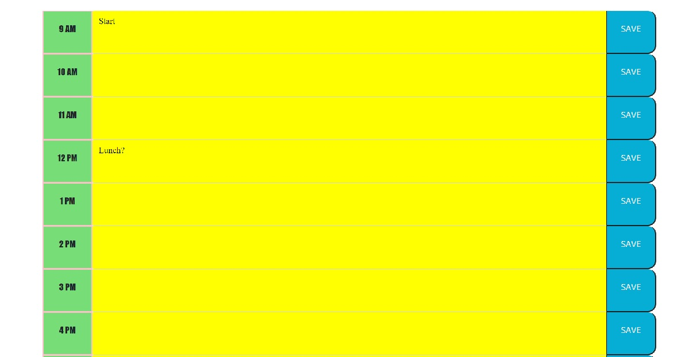

# 05-Homework-WorkDayPlanner

## Description

I made a Work Day Planner.

When the page is loaded, the current day is displayed.

As the user scrolls down, the planner is shown. The planners have hours between 9AM to 5PM. Each row of the planner has the hour, a todo area, and a save button. 

The todo area of the planner will be in a certain color depending on if the time has passed or not. Hours that are coming up will be displayed as yellow. Hours that are past will be displayed as gray. Current hours will be displayed as green.

The user will be able to type directly into the todo area. The user will be able to write whatever task that needs to be done at that hour.

The user can then click on the "SAVE" button. The button will store the todo to the user's local storage. When the user refreshes or re-enters the application, the user will see the stored todo in its respective todo block.

## Screenshots

## Links

GitHub Repository: [https://github.com/jhur628/05-Homework-WorkDayPlanner](https://github.com/jhur628/05-Homework-WorkDayPlanner)

Deployed Application: [https://jhur628.github.io/05-Homework-WorkDayPlanner/](https://jhur628.github.io/05-Homework-WorkDayPlanner/)

## Other Comments

Unfortunately, I was unable to participate in study groups for this assignment. It was a challenging assignment, but I was able to complete it. There were many things that were not covered in our classes; however, I was able to figure out the assignment with the resources given by our instructor and TAs.

Moving forward, I would like to participate in as many study groups as possible. It was a personally busy week for me. I'm sure things would have been slightly less challenging with the help of my peers.

Enjoy.